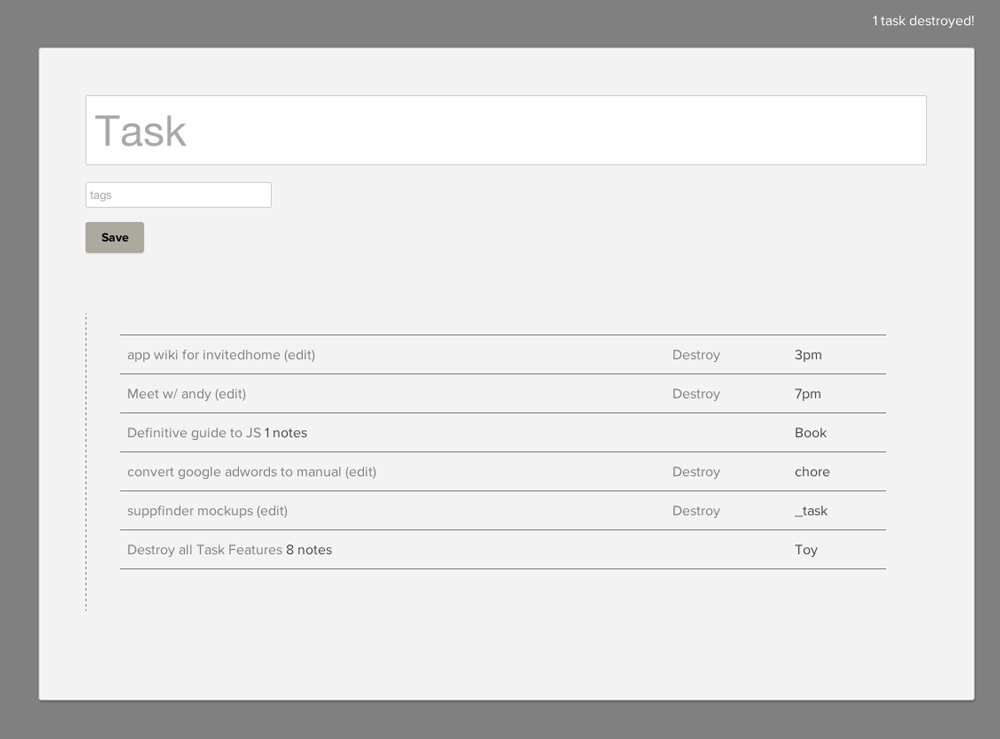
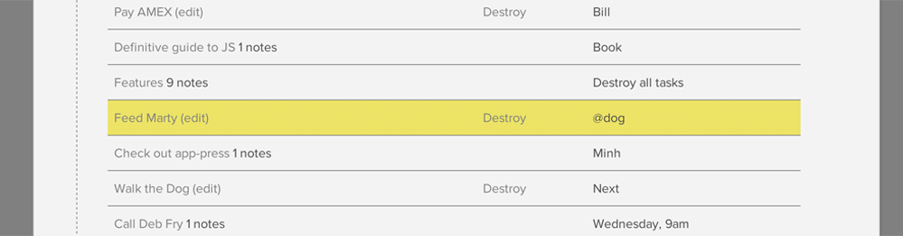
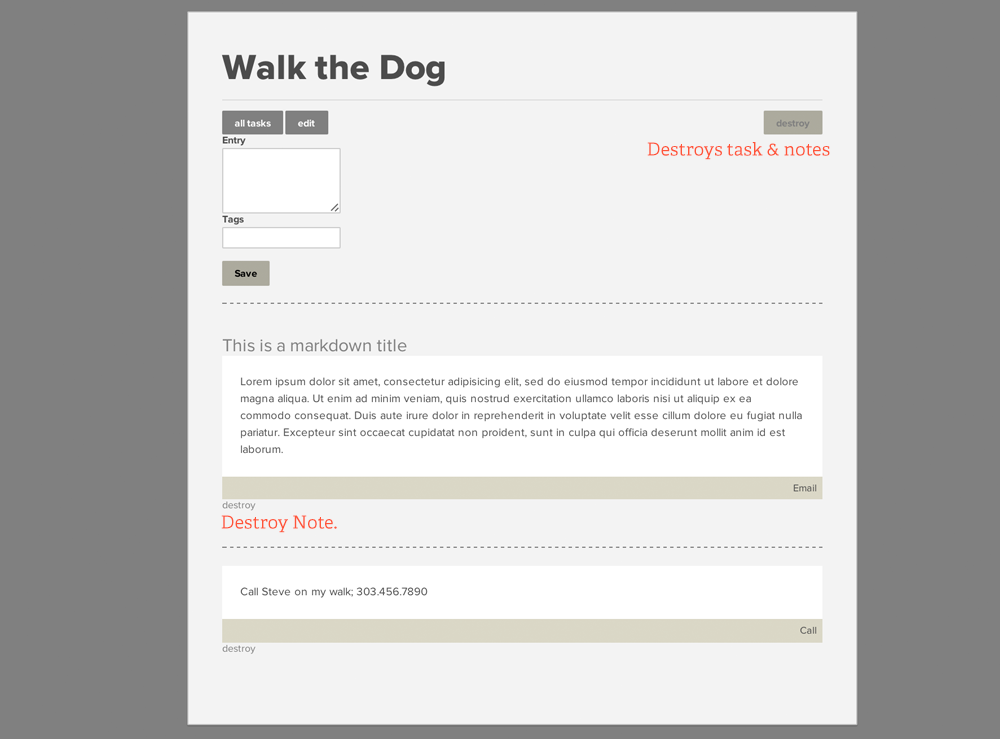

## Inbox zero for tasks

## If you can't destroy it, don't add it.
This is not the place to store memories. Write down what you need to do. Do it. Destroy it.

## Sort by sliding
Lists are sorted by dragging and dropping.

## Tags
Tags are little ear marks for your mind.

### Examples of tags;

- _Book
- 1pm
- @now
- Meeting
- Wednesday, 1pm

### Highlighters
Add an "@" to a tag, like `Lunch @ noon` to highlight the line.

_Other highlighters include '**!**', and '**zzz**'_

## Task Page
Click a task to see it's page to add notes. These notes are temporary references to help you accomplish the quest of destroying the larger task.

### Example

### Notice
Notice you can't delete a task from the list if it has notes. So, you need to review those and delete notes, or super delete notes & task.

### Markdown
You can use markdown in your notes

### Bonus: A bookmark for your brain.
You know those "What was I doing?" moments? Use the Task pages as bookmarks for when meetings, calls, emails, or other things lure you away from destroying tasks.

## Install

- Clone the app
- bundle install
- rake db:migrate
- fire it up
- Add tasks
- Destroy them

## Missing a feature
Feel free to submit pull request, or request a feature if it supports the Task ZERO philosophy.